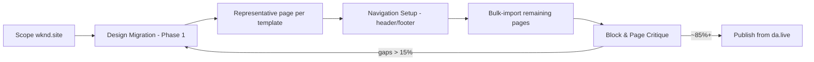

# WKND → EDS Migration — Capstone Instructions (EMA)

> **Mission:** Migrate `wknd.site/us/en.html` and its key pages into an **Adobe Edge Delivery Services (EDS)** site using **Document Authoring (da.live)** as the content source, driven **end‑to‑end by the Adobe Experience Modernization Agent (EMA)**. Aim for a **pixel‑practical, fully responsive** reproduction across mobile, tablet, and desktop.

This document is the single source of truth for the project. **Every decision, prompt, and code change must trace back to a goal or acceptance criterion below.** When in doubt, re‑read the [Guardrails](#8-guardrails--do-not-deviate) and [Definition of Done](#12-definition-of-done).

---

## 1. Objective

- Reproduce the WKND experience (`https://wknd.site/us/en.html` and its key pages) inside **your EDS site** with **da.live** as the content source.
- **Highest priority is EMA usage**: scope → design migration → page migration → navigation → bulk import → critique. **You review and ship every change.**
- Target **pixel‑practical, fully responsive** fidelity — the layout must hold across mobile, tablet, and desktop with **no broken sections or overflow**.

**Source of truth for fidelity:** always judge against the **live/preview URL**, never the DA editor (DA shows blocks as tables).

---

## 2. Key concepts & glossary

| Term | What it means for this project |
|------|-------------------------------|
| **EDS / Edge Delivery Services** | Adobe's document‑ or code‑authored, edge‑served web platform (formerly Franklin/Helix; `aem.live`). Content authored as documents → rendered to semantic HTML → served from the edge. |
| **Document Authoring (da.live)** | The content source. Authors edit documents; blocks appear as **tables**. Content is previewed/published to `*.aem.page` / `*.aem.live`. |
| **EMA (Experience Modernization Agent)** | The AI agent that automates migration: Site Scope, Design Migration, Page Migration, Navigation Setup, Bulk Import, and Block/Page Critique. Supports **Plan mode** (draft the plan) and **Execute mode** (apply it). |
| **Block** | A reusable UI component (folder `blocks/<name>/` with `<name>.js` + `<name>.css`). Follows the **EDS Block Collection** patterns. |
| **Block Collection** | Adobe's canonical block library (Cards, Columns, Hero, Carousel, Tabs, Accordion, Quote, Embed, Fragment, Breadcrumb, Search, Table, Video…). Prefer these patterns over bespoke code. |
| **Parser** | The import logic that maps source DOM → EDS blocks/tables during import. **Durable fidelity fixes belong in parsers/CSS, not one‑off doc edits.** |
| **Preview / Live URLs** | `https://main--<repo>--<org>.aem.page` (preview) and `https://main--<repo>--<org>.aem.live` (live). |
| **`media_` hash** | Optimized, edge‑served image variant. Localize source images into `assets/` so they serve as `media_` hashes (responsive `<picture>`). |
| **CWV** | Core Web Vitals — **LCP** (≤ 2.5 s "good"), **CLS** (≤ 0.1 "good"), **INP** (≤ 200 ms "good"). |

---

## 3. Deliverables (must‑have)

1. **Site Scope report** — inventory of WKND's **templates, block variants, and pages**.
2. **Global design** migrated into `styles/styles.css` — colours, typography, spacing, backgrounds.
3. **Home page** with migrated **header, navigation, and footer**.
4. **A representative page per template**, then the **rest bulk‑imported**.
5. At least **one Magazine/article listing** page **and** one **article detail** page.
6. **Block & page critique** run on key blocks/pages to close visual gaps (**~85 %+ similarity**).
7. **Content synced to Document Authoring** and **code shipped via GitHub PRs**.

---

## 4. Suggested EMA flow (follow in order)



> Use **Plan mode** on complex steps; switch to **Execute** only once the plan looks right. Review the diff before shipping.

### Phase‑by‑phase expectations

- **1. Site Scope** — Run EMA scope on `wknd.site`. Output the template list (Landing/Home, Article/Magazine detail, Magazine listing, Adventure detail, generic Content page, etc.), block variants (Hero, Teaser, Cards, Carousel, Columns, Breadcrumb, Buttons, Embed/Video, Newsletter/Form), and full page inventory. **Save this report** as the migration backlog.
- **2. Design Migration (Phase 1)** — Migrate **global** design tokens into `styles/styles.css`: CSS custom properties for colours, font families/scales, spacing, backgrounds, and default breakpoints. Nothing page‑specific here.
- **3. Representative page per template** — Migrate **one** page for each distinct template first. Get it right (critique ≥ 85 %) **before** bulk work.
- **4. Navigation Setup** — Build **header + nav + footer** (typically `nav.plain.html` / `footer.plain.html` fragments authored in DA). Verify sticky/scroll behaviour and mobile menu.
- **5. Bulk Import** — Import the remaining pages of each template en masse. Spot‑check a sample per template.
- **6. Block & Page Critique** — Run critique on **key blocks and pages**, read the similarity score, and close gaps by editing **parsers/CSS** (re‑import overwrites doc edits). Iterate until ~85 %+.

---

## 5. Acceptance criteria (rubric)

| Area | Target — must pass |
|------|--------------------|
| **Visual fidelity** | Pages closely match the source; **block & page critique ≥ ~85 %** similarity; key blocks look right by eye against `wknd.site`. |
| **Responsive** | Layout holds across **mobile, tablet, desktop** — **no broken sections or overflow** at any breakpoint. |
| **Performance** | **Mobile Lighthouse / PageSpeed 100** on the **home page** and an **article page**; **LCP** and **CLS** within CWV "good". |
| **Accessibility** | **Lighthouse Accessibility 100**; fully **keyboard‑navigable**; **all images have meaningful alt text**. |
| **Content workflow** | All content imported into **DA and published**; at least one page **previewed and published from da.live**. |
| **Code quality & governance** | **Lint passes**; blocks follow **Block Collection** patterns; **every change via a feature branch + PR** — nothing pushed straight to `main`. |

---

## 6. Technical standards

### 6.1 Repository structure (EDS)

```
/
├─ blocks/               # one folder per block: <name>/<name>.js + <name>/<name>.css
├─ styles/
│  ├─ styles.css         # global design tokens + base layout (Design Migration target)
│  └─ fonts.css          # @font-face / font loading
├─ scripts/
│  ├─ scripts.js         # site bootstrap (decorate, load eager/lazy/delayed)
│  └─ aem.js             # EDS runtime (do not hand-edit unless required)
├─ icons/                # inline SVG icons
├─ assets/               # localized images → served as optimized media_ hashes
├─ head.html             # <head> injections (fonts, meta)
├─ fstab.yaml            # mounts da.live content source
├─ helix-query.yaml      # indexing for listings + site search (stretch)
├─ 404.html / robots.txt
└─ package.json          # lint scripts + tooling
```

### 6.2 Blocks

- **Prefer the Block Collection.** Only build a custom block when no collection block fits — and if you do, have EMA critique it against the source.
- Each block owns its CSS scoped under `.<block-name>`; **no global bleed**.
- JS: default‑export `decorate(block)`; keep it minimal, progressive‑enhancement only. No blocking network calls in the eager phase.
- Keep DOM semantic (`<header>`, `<nav>`, `<main>`, `<article>`, `<footer>`, headings in order).

### 6.3 Global CSS / design tokens

- Put durable global styling in `styles/styles.css` via **CSS custom properties** (`:root { --color-*, --font-*, --spacing-* }`).
- Match WKND colours, type scale, spacing, and backgrounds sampled from the source.
- **Durable changes live in parsers/CSS.** Re‑imports overwrite one‑off doc edits — never "fix" fidelity by editing the DA document.

### 6.4 Responsive breakpoints

Match the source; use the EDS‑standard set unless WKND differs:

| Breakpoint | Range | Notes |
|-----------|-------|-------|
| **Mobile** | `< 600px` | Default (mobile‑first) styles. |
| **Tablet** | `≥ 600px` | `@media (width >= 600px)` |
| **Desktop** | `≥ 900px` | `@media (width >= 900px)` |
| **Large** | `≥ 1200px` | Optional max‑width container. |

Verify each block at every breakpoint — **no horizontal overflow, no clipped text/images**.

### 6.5 Performance playbook (target: 100)

- **LCP image loads eagerly** (`loading="eager"`, `fetchpriority="high"`); everything below the fold is lazy.
- Use responsive `<picture>` with `media_` hashes; always set width/height (or aspect‑ratio) to **prevent CLS**.
- Keep the eager phase tiny; defer non‑critical JS to the **delayed** phase.
- Preload/`font-display: swap` for fonts; avoid layout‑shifting web‑font swaps.
- No render‑blocking third‑party scripts on home/article pages.

### 6.6 Accessibility playbook (target: 100)

- **Meaningful `alt`** on every content image (empty `alt=""` only for decorative).
- Logical heading order; landmarks; visible focus states; skip‑to‑content where relevant.
- Colour contrast ≥ WCAG AA; interactive elements reachable and operable by keyboard.
- Buttons/links have discernible names; forms have labels.

---

## 7. Content & Git workflow

### 7.1 Document Authoring (da.live)

- Author/import content into DA; blocks appear as **tables** — that's expected.
- **Preview** then **Publish** from da.live. Confirm on `*.aem.page` (preview) and `*.aem.live` (live).
- Localize source images into `assets/` so they serve as optimized `media_` hashes.
- At least **one page must be previewed and published from da.live** end‑to‑end.

### 7.2 Git / GitHub governance

- **Never commit to `main` directly.** Create a **feature branch per unit of work** (e.g. `feat/design-migration`, `feat/home-nav`, `feat/magazine-template`).
- Open a **PR** for every change; keep PRs focused and reviewable; write a clear description linking the deliverable/criterion.
- **Lint must pass** before merge: run `npm run lint` (ESLint + Stylelint) locally and in CI.
- Squash‑or‑merge only green PRs. **You review and approve every change.**

---

## 8. Guardrails — do NOT deviate

1. **EMA‑first.** Use EMA for scope, design, page migration, navigation, bulk import, and critique. Manual coding is only to close gaps EMA can't.
2. **Judge on the live/preview URL**, never the DA table view.
3. **Durable fixes go in parsers/CSS**, never one‑off DA doc edits (re‑imports overwrite them).
4. **No direct pushes to `main`.** Feature branch → PR → review → merge. Always.
5. **Lint stays green.** No merging red builds.
6. **Block Collection first.** Custom blocks are the exception, not the default.
7. **Representative page before bulk.** Prove a template at ~85 %+ before importing the rest.
8. **Performance & a11y are acceptance gates**, not afterthoughts — protect LCP/CLS and alt text on every change.
9. **Localize images to `assets/`** for `media_` optimization.
10. Keep scope to WKND's public pages — see [Out of scope](#10-out-of-scope).

---

## 9. Stretch goals (optional)

- **Site search** — index‑driven results across migrated content (drive via `helix-query.yaml` + a Search block).
- **Redirects** — map old WKND URLs to new paths and confirm **301** responses.
- **Hand‑built custom block** — add one by hand and have **EMA critique** it against the source.

---

## 10. Out of scope

- Strict pixel perfection beyond practical design fidelity (EMA automates practical fidelity).
- Commerce/search backends, MarTech/targeting, custom business logic, and sign‑in/auth.

---

## 11. Tips for a clean result

- Always judge the result on the **live/preview URL**, not the DA editor (blocks show as tables there).
- Keep **durable changes in parsers/CSS** — re‑imports overwrite one‑off doc edits.
- **Localize images to `assets/`** so they serve as optimized `media_` hashes.
- Fix the **representative page** fully before bulk‑importing its siblings — one good template saves dozens of re‑fixes.
- Re‑run **critique** after every batch of fidelity fixes to confirm the score is climbing toward ~85 %+.

---

## 12. Definition of Done

- [ ] **Site Scope report** generated for `wknd.site` (templates, block variants, pages).
- [ ] **Global design** migrated into `styles/styles.css` (colours, type, spacing, backgrounds).
- [ ] **Home page** with migrated **header, navigation, and footer**.
- [ ] **A representative page per template** migrated; **remaining pages bulk‑imported**.
- [ ] **Magazine listing** + **article detail** pages present.
- [ ] **Block & page critique** run to close visual gaps (**~85 %+**).
- [ ] **Fully responsive** across mobile, tablet, and desktop (no overflow/broken sections).
- [ ] **Mobile Lighthouse 100** (Performance & Accessibility); **CWV in "good"** (LCP, CLS).
- [ ] **Content synced and published** to Document Authoring (≥ 1 page previewed + published from da.live).
- [ ] **All changes via feature branches + PRs** (no direct commits to `main`); **lint passes**.
- [ ] **Site hosted**; **live URL and repository shared** for review.
